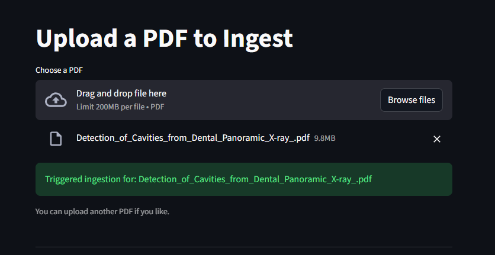
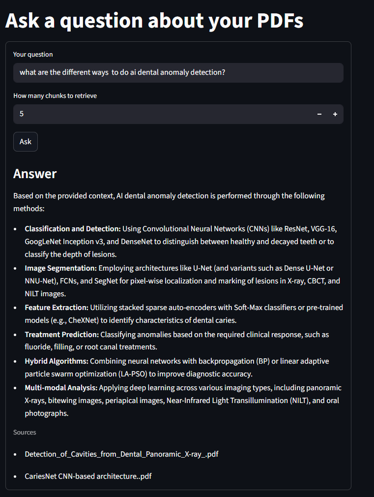

# RAGProductionApp

An event-driven Retrieval-Augmented Generation (RAG) app that lets you upload PDF files, index them into Qdrant, and ask grounded questions through a Streamlit UI.

## What This Project Currently Does

- Ingests PDF files from the UI and stores them under `uploads/`
- Splits extracted PDF text into chunks with overlap
- Embeds chunks using `gemini-embedding-2-preview`
- Stores vectors and payload text in a local Qdrant collection (`docs`)
- Accepts a question, retrieves top-k relevant chunks, and generates an answer with Gemini
- Uses Inngest events and functions to orchestrate ingestion and query workflows

## Why This Design

- Streamlit for the interface:
	Fast way to build and iterate on a document Q&A front end.
- Inngest for orchestration:
	Ingestion and query steps are modeled as event-driven workflows, which keeps the pipeline explicit and observable.
- Qdrant for retrieval:
	Vector search returns the most similar chunks needed for grounded generation.
- Gemini embeddings + generation:
	The same provider is used for both semantic representation and final response generation, which simplifies integration.
- Text-chunk payloads in the vector store:
	Retrieved text can be directly placed into the answer prompt, which keeps responses traceable to stored context.

## Current Limitations (Honest Scope)

- Input type is PDF only right now (no image ingestion yet)
- Qdrant URL is currently hardcoded to `http://localhost:6333` in `vector_db.py`
- Environment variable used for Gemini is `GOOGLE_API`
- No explicit retry policy is configured in code for Inngest functions yet

## Architecture

```text
Streamlit UI
	-> send Inngest event (ingest)
	-> Inngest function loads PDF text
	-> chunk text
	-> embed chunks
	-> upsert vectors + payload text in Qdrant

Streamlit UI
	-> send Inngest event (query)
	-> embed question
	-> Qdrant top-k retrieval
	-> Gemini answer from retrieved context
	-> answer shown in UI
```

## Demo

Add product screenshots or a short GIF here so people can see the app before they clone it.

Suggested repo structure for media:

```text
assets/
	demo-upload.png
	demo-answer.png
	demo-flow.gif
```

Example markdown you can keep and replace later:

```markdown



```

## Project Files

```text
RAGProductionApp/
	main.py             # FastAPI + Inngest workflow functions
	Streamlit_app.py    # Upload and question-answer UI
	data_loader.py      # PDF loading, chunking, embeddings
	vector_db.py        # Qdrant collection, upsert, search
	custom_types.py     # Pydantic models for workflow payloads
	uploads/            # Uploaded PDFs
	qdrant_storage/     # Local Qdrant data directory (if running local persistence)
	pyproject.toml      # Project metadata and dependencies
	requirements.txt    # Exported dependency lock-style list
```

## Requirements

- Python 3.11+
- Qdrant running locally on port 6333
- Google Gemini API key
- Inngest local dev server for local workflow execution

## Setup

1. Install dependencies:

```bash
pip install -r requirements.txt
```

2. Create a `.env` file in the project root:

```env
GOOGLE_API=your_gemini_api_key
INNGEST_API_BASE=http://127.0.0.1:8288/v1
```

3. Keep secrets safe:

- Ensure `.env` stays in `.gitignore`
- Never commit real API keys

## Run Locally

1. Start Inngest dev server:

```bash
npx inngest-cli@latest dev
```

2. Start the FastAPI app (Inngest handler host):

```bash
uvicorn main:app --reload
```

3. Start the Streamlit app:

```bash
streamlit run Streamlit_app.py
```

## Notes For Future Improvements

- Add image ingestion by introducing OCR in `data_loader.py`
- Move Qdrant URL into environment variables
- Add explicit Inngest retry configuration and document it
- Add tests for ingestion and retrieval paths
